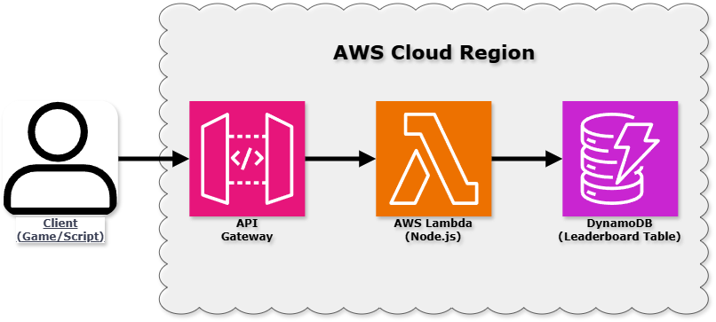

# Serverless Game Leaderboard API (AWS)



A fully serverless, highly scalable, and cost-effective REST API backend designed to manage leaderboards and player scores for games. Built using AWS core serverless services, this project implements a single-table design pattern with Amazon DynamoDB.

## Architecture

The system uses a 100% serverless architecture on AWS:

- **Amazon API Gateway (HTTP API):** Acts as the public entry point, routing incoming HTTP requests to the appropriate AWS Lambda functions.
- **AWS Lambda (Node.js 24.x):** Executes stateless business logic for registering player scores and querying top leaderboard rankings.
- **Amazon DynamoDB:** Stores game scores and player stats using On-Demand capacity for zero idle cost and seamless scaling.
- **AWS IAM:** Enforces least-privilege execution roles between Lambda functions and DynamoDB resources.

## Database Design

The database uses Amazon DynamoDB with a Single-Table Design pattern:

- **Table Name:** `GameScores`
- **Partition Key (`PK`):** `GAME#{game_id}` (e.g., `GAME#SpaceShooter_v1`)
- **Sort Key (`SK`):** `PLAYER#{player_id}` (e.g., `PLAYER#usr_1029`)
- **Attributes:** `player_name` (String), `score` (Number), `updated_at` (ISO Timestamp)

## API Endpoints

### 1. Register Score
- **Method:** `POST`
- **Path:** `/scores`
- **Headers:** `Content-Type: application/json`
- **Body:**
```json
{
  "game_id": "SpaceShooter_v1",
  "player_id": "usr_1029",
  "player_name": "AcePlayer",
  "score": 15000
}
```

Response (200 OK):

```json
{
  "message": "Score registered successfully",
  "player": "AcePlayer",
  "score": 15000
}
```

### 2. Get Top Leaderboard

Method: GET

Path: /scores?game_id=SpaceShooter_v1

Response (200 OK):

```json
{
  "game_id": "SpaceShooter_v1",
  "leaderboard": [
    {
      "player_id": "usr_1029",
      "player_name": "AcePlayer",
      "score": 15000,
      "updated_at": "2026-08-11T03:48:11.927Z"
    }
  ]
}
```

## Local Testing Examples (PowerShell)

Registering a Score:

```powershell
Invoke-RestMethod -Uri "https://YOUR_API_ID.execute-api.YOUR_REGION.amazonaws.com/scores" `
  -Method Post `
  -ContentType "application/json" `
  -Body '{"game_id": "SpaceShooter_v1", "player_id": "usr_1029", "player_name": "AcePlayer", "score": 15000}'
```

Fetching Top Scores:

```powershell
Invoke-RestMethod -Uri "https://YOUR_API_ID.execute-api.YOUR_REGION.amazonaws.com/scores?game_id=SpaceShooter_v1"
```

## Security & Best Practices

- **Cost Protection:** AWS Budgets configured with zero-spend threshold alerts.
- **IAM Authorization:** Role-based access control with scoped permissions for DynamoDB actions.
- **Data Abstraction:** DynamoDB internal keys (PK/SK) are sanitized at the Lambda layer before returning response payloads.
- **Data Validation:** Input parsing and fallback handling on Lambda execution.